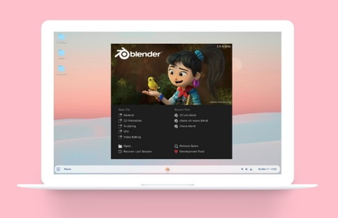

# My Linux Setup
All the tweaks I make to my Linux setup for future reference.

# My System 
- Zorin OS 16 (based on Ubuntu 20.04 LTS)
- Macbook Pro early 2014

# My Tweaks
- ⚙️ [Tweaks](Tweaks.md)
- 🩹 [Fixes](Fixes.md)
- 🏎️ [Preformance Boosts](PreformanceBoosts.md)
- 💻 [Macbook Specific](MacbookSpecific.md)

# Gnome
- 👣 [Gnome Extensions](GnomeExtensions.md)
- 👣 [Custom Launcher Entries](GnomeCustomLauncherEntries.md)
- 📁 [Nautilus File Manager Tweaks](Nautilus.md)
- 📁 [Nautilus Scripts](NautilusScripts.md)

# Apps
- 🛠️ [Apps](Apps.md)

# Theming
- 🎨 [How to install mouse & icon themes](HowToInstallMouseAndIconThemes.md)
- ⌨️ [Change a theme's CSS](ChangeAThemesCSS.md)
